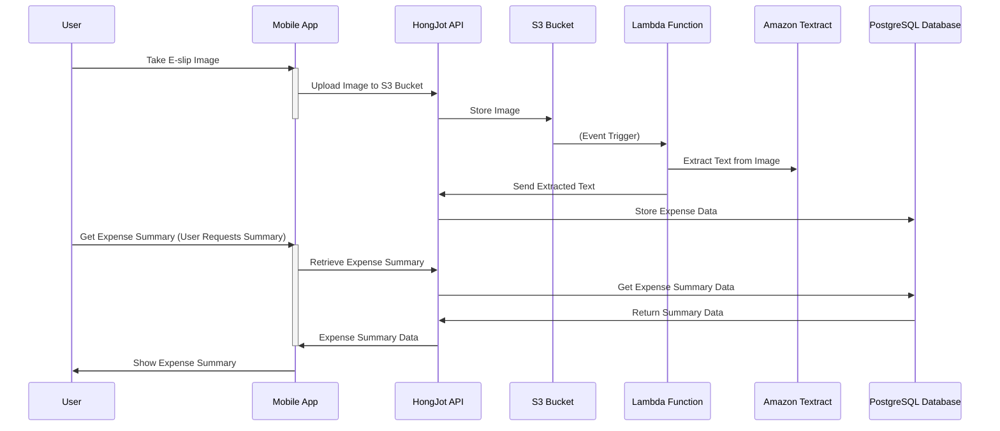

# HongJot Diagram

```mermaid
sequenceDiagram
  User->>Mobile App: Take E-slip Image
  activate Mobile App
  Mobile App->>HongJot API: Upload Image to S3 Bucket
  HongJot API->>S3 Bucket: Store Image
  deactivate Mobile App
  S3 Bucket->>Lambda Function: (Event Trigger)
  Lambda Function->>Amazon Textract: Extract Text from Image
  Lambda Function->>HongJot API: Send Extracted Text
  HongJot API->>PostgreSQL Database: Store Expense Data

  User->>Mobile App: Get Expense Summary (User Requests Summary)
  activate Mobile App
  Mobile App->>HongJot API: Retrieve Expense Summary
  HongJot API->>PostgreSQL Database: Get Expense Summary Data
  PostgreSQL Database->>HongJot API: Return Summary Data
  HongJot API->>Mobile App: Expense Summary Data
  deactivate Mobile App
  Mobile App->>User: Show Expense Summary
```
