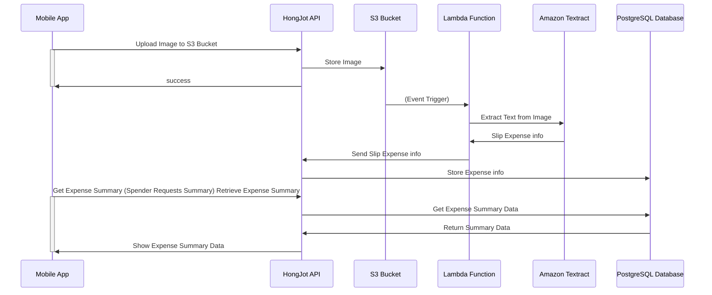

# Go summer workshop

- [Pre-requisites](#pre-requisites)
- [Tools](#tools)
- [HongJot Diagram](#hongjot-diagram)
- [Getting Started](#getting-started)
  - [Step 0: IaC (Infrastructure as Code)](#step-0-iac-infrastructure-as-code-)
  - [Step 1: Fork the repository and setup Github Actions](#step-1-fork-the-repository-and-setup-github-actions-)
  - [Step 2: Create ArgoCD application](#step-2-create-argocd-application)

## Pre-requisites
- [Go version 1.21.9 or higher installed](https://go.dev/dl/)
- [Docker installed](https://docs.docker.com/get-docker/)
- [Terraform](https://learn.hashicorp.com/tutorials/terraform/install-cli) - Never mind if you don't have it, we have
  done it for you

## Tools
- SonarQube - [https://sonarqube.werockstar.dev/](https://sonarqube.werockstar.dev/)
- ArgoCD - [https://argocd.werockstar.dev/](https://argocd.werockstar.dev/)

# HongJot Diagram

## Infrastructure

We have created the infrastructure by using Terraform. The infrastructure consists of the following:

- `Kubernetes Cluster (EKS)` - Managed Kubernetes Service
- `PostgreSQL (RDS)` - Relational Database (Managed Service)
- `SonarQube` - Static Code Analysis
- Github (see `.github/workflows` directory)
	- Github Action
	- Github Container Registry
- ArgoCD - Continuous Delivery
- Cloudflare - DNS Management

## Getting Started

### Step 0: IaC (Infrastructure as Code) ✅
- Create **IAM** account for `Terraform`
- Authenticate with AWS
	- Option 1: `aws configure` - Configure your AWS credentials with keypair
	- Option 2: Set environment variable
		- `export AWS_ACCESS_KEY_ID=<KEY>`
		- `export AWS_SECRET_ACCESS_KEY=<SECRET>`
- Create `ESK Cluster`
	- `cd infra/iac/eks`
	- `terraform init`
	- `terraform apply`
	- `Terraform` will require `Cloudflare` API key, you can get it from the `Cloudflare` dashboard
		- Option 1: Enter API token on Terraform prompt
		- Option 2: Export environment variable that provide for Terraform
	- And then Terraform will proceed to create the EKS Cluster
	- Waiting and enjoy your coffee
- Create `RDS (Postgres)`
	- `cd infra/iac/rds`
	- `terraform init`
	- `terraform apply -auto-approve`
	- You need to input username and password for the RDS
	- Terraform will create the RDS
	- And then output the RDS endpoint
- Create `SonarQube`
	- `cd infra/iac/sonarqube`
	- `terraform init`
	- `terraform apply -auto-approve`
	- You need to input `Cloudflare` API key
	- Terraform will create the `SonarQube`
	- And then output the SonarQube endpoint
	- You can access default username and password via `infra/iac/sonar/ansible`
	- Run `make get-cred` in Ansible directory
- Mapping DNS with `Cloudflare`
	- We have created the DNS mapping for every group in the workshop such as:
	- Dev
		- `group-1-b1-dev`: `group-1-b1-dev.werockstar.dev`
	- Prod
		- `group-1-b1-prod`: `group-1-b1-prod.werockstar.dev`
- Create `ArgoCD` application (No need to do anything because we have done it for demo purpose)
	- ArgoCD will automatically deploy the application to the EKS cluster
- Importantly, you need to destroy the infrastructure after the workshop
	- `terraform destroy` in each directory

### Step 1: Fork the repository and setup Github Actions ✅
- Fork `workshop-summer` repository and name it as `workshop-summer-<GROUP_NO>-<BATCH_NO>` (e.g. `workshop-summer-group-1-b1`)
- Enable Github Actions in the repository
- Replace the `<GROUP_NO>` pattern via `auto-replace-group.sh`
- Setup project on `SonarQube` manually
  - Create project on `SonarQube` with the same name as the repository
  - Generate SonarQube token and create secret on Github named as `SONAR_TOKEN`
  - Add `SONAR_HOST_URL` secret on Github with the value of https://sonarqube.werockstar.dev
- Commit and push the changes to the repository
- View the `Github Actions` and see the workflow running
- Observe analysis result on `SonarQube` dashboard

### Step 2: Create ArgoCD application

- Setup GitOps สำหรับ Development
  - กด `+ New App` แล้วใส่ข้อมูลดังนี้
  - Application Name: `<GROUP_NO>-<BATCH_NO>-dev` (e.g. `group-1-b1-dev`)
  - Project Name: `default`
  - SYNC POLICY: `Automatic`
  - ✅ PRUNE RESOURCES
  - Repository URL: `https://github.com/<your-github>/workshop-summer-<GROUP_NO>-<BATCH_NO>`
  - Revision: `main`
  - Path: `infra/gitops/dev`
  - Cluster URL: `https://kubernetes.default.svc`
  - กด `Create` มุมบนซ้าย
  - ภาวะณา
- Setup GitOps สำหรับ Production env
   - กด `+ New App` แล้วใส่ข้อมูลดังนี้
   - Application Name: `<GROUP_NO>-<BATCH_NO>-prod` (e.g. `group-1-b1-prod`)
   - Project Name: `default`
   - SYNC POLICY: `Automatic`
   - ✅ PRUNE RESOURCES
   - Repository URL: `https://github.com/<your-github>/workshop-summer-<GROUP_NO>-<BATCH_NO>`
   - Revision: `main`
   - Path: `infra/gitops/prod`
   - Cluster URL: `https://kubernetes.default.svc`
   - กด `Create` มุมบนซ้าย
