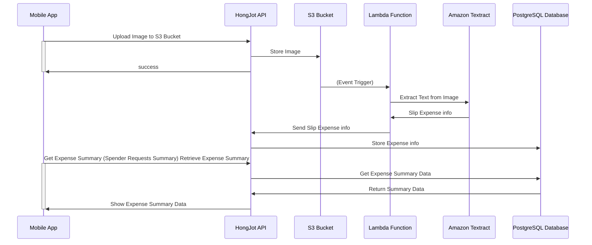

# Go summer workshop

## Pre-requisites
- [Go version 1.21.9 or higher installed](https://go.dev/dl/)
- [Docker installed](https://docs.docker.com/get-docker/)
- [Terraform](https://learn.hashicorp.com/tutorials/terraform/install-cli) - Never mind if you don't have it, we have
  done it for you

## Tools
- SonarQube - [https://sonarqube.werockstar.dev/](https://sonarqube.werockstar.dev/)
- ArgoCD - [https://argocd.werockstar.dev/](https://argocd.werockstar.dev/)

# HongJot Diagram

## Infrastructure

We have created the infrastructure for you using Terraform. The infrastructure consists of the following:

- Kubernetes Cluster (EKS) - Managed Kubernetes Service
- `PostgreSQL` (RDS) - Relational Database (Managed Service)
- `SonarQube` - Static Code Analysis
- Github
	- Github Action
	- Github Container Registry
- ArgoCD - Continuous Delivery

## How to use Terraform

- Create **IAM** account for `Terraform`
- `aws configure` - Configure your AWS credentials
- Create ESK Cluster
	- `cd infra/iac/eks`
	- `terraform init`
	- `terraform apply`
	- `Terraform` will require `Cloudflare` API key, you can get it from the `Cloudflare` dashboard
	- And then Terraform will proceed to create the EKS Cluster
	- Waiting and enjoy your coffee
- Create RDS
	- `cd infra/iac/rds`
	- `terraform init`
	- `terraform apply -auto-approve`
	- You need to input username and password for the RDS
	- Terraform will create the RDS
	- And then output the RDS endpoint
- Create SonarQube
	- `cd infra/iac/sonarqube`
	- `terraform init`
	- `terraform apply -auto-approve`
	- You need to input `Cloudflare` API key
	- Terraform will create the `SonarQube`
	- And then output the SonarQube endpoint
	- You can access default username and password via `infra/iac/sonar/ansible`
	- Run `make get-cred` in Ansible directory
- Mapping DNS with `Cloudflare`
	- We have created the DNS mapping for every group in the workshop such as:
	- Dev
		- `group-1-dev`: `group-1-dev.werockstar.dev`
	- Prod
		- `group-1-prod`: `group-1-prod.werockstar.dev`
- Create `ArgoCD` application (No need to do anything because we have done it for demo purpose)
	- ArgoCD will automatically deploy the application to the EKS cluster
