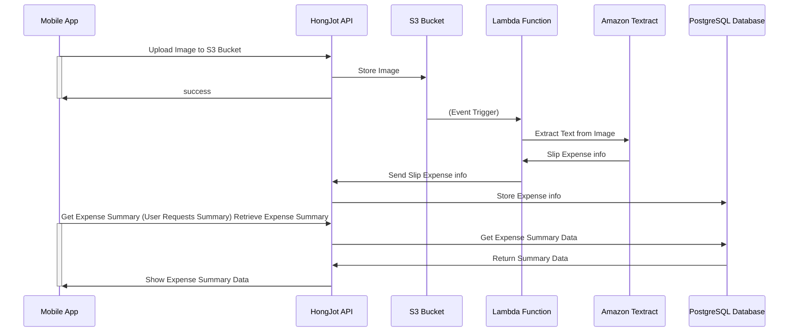

# Go summer workshop

## Pre-requisites
- [Go version 1.21.9 or higher installed](https://go.dev/dl/)
- [Docker installed](https://docs.docker.com/get-docker/)
- [Terraform](https://learn.hashicorp.com/tutorials/terraform/install-cli) - Never mind if you don't have it, we have done it for you

# HongJot Diagram

