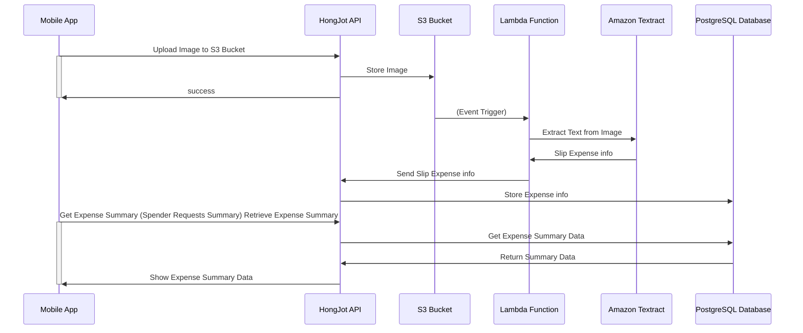

# HongJot Requirements

## Context
HongJot is a mobile app that helps spenders to track their expenses. Spenders can take a picture of their receipts and the app will extract the expense information from the image. The app will then store the expense information in a database and provide a summary of the expenses to the spender.

# Spender Stories
## Story 1: As a spender, I want to upload an image of my receipt so that I can track my expenses.

Acceptance Criteria:
- The spender can upload an image of their receipt.
- The image is stored in an S3 bucket.
- The spender receives a success message after the image is uploaded.

Technical Requirements:
- REST API to upload an image to an S3 bucket.
- Endpoint POST /upload to upload an image.
- Response 200 OK with a success message.
- should handle any error and response appropriate error message and status code.

## Story 2: As a Admin, I want to view a all of expenses list so that I can manupulate the expenses for spender.

Acceptance Criteria:
- The Admin can view a list of all their expenses.

Technical Requirements:
- REST API to get a list of all expenses.
- Endpoint GET /expenses to get a list of all expenses.
- Response 200 OK with a list of expenses.
- should handle any error and response appropriate error message and status code.

## Story 3: As a Admin, I want pagging and filtering for expenses list so that I can view the expenses in a more organized way.

Acceptance Criteria:
- The Admin can view a list of all their expenses with pagging and filtering.
- The Admin can filter the expenses by date, amount, or category.
- The Admin can view the expenses in pages of 10 items each page.
- The Admin can navigate to the next or previous page.

Technical Requirements:
- REST API to get a list of all expenses with pagging and filtering.
- Endpoint GET /expenses to get a list of all expenses with pagging and filtering.
- Response 200 OK with a list of expenses.
- should handle any error and response appropriate error message and status code.

## Story 4: As a Tech Lead, I want to provide an API to create a new expense and store it into database so that lambda function can use it to store the expense information that get from Amazon Textract.

Acceptance Criteria:
- The Labmda can create a new expense and store it in the database.
- The expense should have the following fields: date, amount, category, and image URL.

Technical Requirements:
- REST API to create a new expense.
- Endpoint POST /expenses to create a new expense.
- Request body should contain the date, amount, category, and image URL.
- Response 200 OK with the created expense.
- should handle any error and response appropriate error message and status code.

## Story 5: As a Spender, I want to record my expenses so that I can track my spending.

Acceptance Criteria:
- The spender can record their expenses by providing the date, amount, category, and image URL.
- The expense is stored in the database.
- The spender receives a success message after the expense is recorded.

Technical Requirements:
- REST API to record an expense.
- Endpoint POST /expenses to record an expense.
- Request body should contain the date, amount, category, and image URL.
- Response 200 OK with a success message.

## Story 6: As a Spender, I want to record my income so that I can track my income.

Acceptance Criteria:
- The spender can record their income by providing the date, amount, category, and image URL.
- The income is stored in the database.
- The spender receives a success message after the income is recorded.

Technical Requirements:
- REST API to record an income.
- Endpoint POST /incomes to record an income.
- Request body should contain the date, amount, category, and image URL.
- Response 200 OK with a success message.
- should handle any error and response appropriate error message and status code.

## Story 7: As a Spender, I want to view a detailed list of my expenses so that I can see the details of each expense.

Acceptance Criteria:
- The spender can view a detailed list of their expenses.
- The detailed list should include the date, amount, category, and image URL of each expense.

Technical Requirements:
- REST API to get a detailed list of expenses.
- Endpoint GET /expenses/detail to get a detailed list of expenses.
- Response 200 OK with the detailed list of expenses.
- should handle any error and response appropriate error message and status code.

## Story 8: As a Spender, I want to view a summary of my expenses so that I can see how much I have spent.

Acceptance Criteria:
- The spender can view a summary of their expenses.
- The summary should include the total amount spent, the average amount spent per day, and the total number of expenses.

Technical Requirements:
- REST API to get a summary of expenses.
- Endpoint GET /expenses/summary to get a summary of expenses.
- Response 200 OK with the summary of expenses.

## Story 9: As a Spender, I want to view a summary of my income so that I can see how much I have earned.

Acceptance Criteria:
- The spender can view a summary of their income.
- The summary should include the total amount earned, the average amount earned per day, and the total number of income.

Technical Requirements:
- REST API to get a summary of income.
- Endpoint GET /incomes/summary to get a summary of income.
- Response 200 OK with the summary of income.
- should handle any error and response appropriate error message and status code.

## Story 10: As a Spender, I want viw a summary balance of my income and expenses so that I can see how much I have saved.

Acceptance Criteria:
- The spender can view a summary balance of their income and expenses.
- The summary should include the total amount earned, the total amount spent, and the total amount saved.
- The total amount saved is calculated as the total amount earned minus the total amount spent.

Technical Requirements:
- REST API to get a summary balance of income and expenses.
- Endpoint GET /balance to get a summary balance of income and expenses.
- Response 200 OK with the summary balance of income and expenses.
- should handle any error and response appropriate error message and status code.

## Story 11: As a Spender, I want to edit an expense so that I can edit it from my records.

Acceptance Criteria:
- The spender can edit an expense by providing the date, amount, category, and image URL.
- The expense is updated in the database.
- The spender receives a success message after the expense is updated.

Technical Requirements:
- REST API to edit an expense.
- Endpoint PUT /expenses/{id} to edit an expense.
- Request body should contain the date, amount, category, and image URL.
- Response 200 OK with a success message.
- should handle any error and response appropriate error message and status code.


## Some hints to help the participants get started with the workshop.
<details>
  <summary>Technical hints: อย่าพึ่งเปิดให้คิดเองก่อน</summary>
1. GET /api/v1/transections

- Description: Retrieves a list of all transections.
- Response:
- Status Code: 200 OK
- Content Type: application/json
- Example Payload:

```json
{
	"transections": [
		{
			"id": 1,
			"date": "2024-04-30T09:00:00.000Z",
			"amount": 1000,
			"category": "Food",
			"transaction_type": "expense",
			"note": "Lunch",
			"image_url": "https://example.com/image1.jpg"
		},
		{
			"id": 2,
			"date": "2024-04-29T19:00:00.000Z",
			"amount": 2000,
			"category": "Transport",
			"transaction_type": "income",
			"note": "Salary",
			"image_url": "https://example.com/image2.jpg"
		}
	]
}
```

2. GET /api/v1/transections?page=1&limit=10&date=2024-04-30&amount=1000&category=Food&transaction_type=expense|income

- Description: Retrieves a list of all transections with pagging and filtering.
- Query Parameters:
	- page: The page number to retrieve. Default is 1.
	- limit: The number of items per page. Default is 10.
	- date: Filter by date. Format is YYYY-MM-DD.
	- amount: Filter by amount.
	- category: Filter by category.
	- transaction_type: Filter by transaction type (income or expense).
- Response:
- Status Code: 200 OK
- Content Type: application/json
- Example Payload:

```json
{
	"transections": [
		{
			"id": 1,
			"date": "2024-04-30T09:00:00.000Z",
			"amount": 1000,
			"category": "Food",
			"transaction_type": "expense",
			"note": "Lunch",
			"image_url": "https://example.com/image1.jpg"
		},
		{
			"id": 2,
			"date": "2024-04-29T19:00:00.000Z",
			"amount": 2000,
			"category": "Transport",
			"transaction_type": "income",
			"note": "Salary",
			"image_url": "https://example.com/image2.jpg"
		}
	],
	"summary": {
    "total_income": 2000,
    "total_expenses": 1000,
    "current_balance": 1000
  },
  "pagination": {
    "current_page": 1,
    "total_pages": 1,
    "per_page": 10
  }
}
```

4. POST /api/v1/transections

- Description: Creates a new transection so that can record the income or expense.
- Request Body:
- Content Type: application/json
- Example Payload:

```json
{
	"date": "2024-04-30T09:00:00.000Z",
	"amount": 1000,
	"category": "Food",
	"transaction_type": "expense",
	"note": "Lunch",
	"image_url": "https://example.com/image1.jpg"
}
```

- Response:
- Status Code: 201 Created
- Content Type: application/json
- Example Payload:

```json
{
	"id": 1,
	"date": "2024-04-30T09:00:00.000Z",
	"amount": 1000,
	"category": "Food",
	"transaction_type": "expense",
	"note": "Lunch",
	"image_url": "https://example.com/image1.jpg"
}
```

5. PUT /api/v1/transections/{id}

- Description: Updates an existing transection so that can edit the income or expense.
- Request Body:
- Content Type: application/json
- Example Payload:

```json
{
	"date": "2024-04-30T09:00:00.000Z",
	"amount": 1000,
	"category": "Food",
	"transaction_type": "expense",
	"note": "Lunch",
	"image_url": "https://example.com/image1.jpg"
}
```

- Response:
- Status Code: 200 OK
- Content Type: application/json
- Example Payload:

```json
{
	"id": 1,
	"date": "2024-04-30T09:00:00.000Z",
	"amount": 1000,
	"category": "Food",
	"transaction_type": "expense",
	"note": "Lunch",
	"image_url": "https://example.com/image1.jpg"
}
```

6. GET /api/v1/spenders/{id}/transections

- Description: Retrieves a list of all transections for a specific spender.
- Response:
- Status Code: 200 OK
- Content Type: application/json
- Example Payload:

```json
{
	"transections": [
		{
			"id": 1,
			"date": "2024-04-30T09:00:00.000Z",
			"amount": 1000,
			"category": "Food",
			"transaction_type": "expense",
			"note": "Lunch",
			"image_url": "https://example.com/image1.jpg"
		},
		{
			"id": 2,
			"date": "2024-04-29T19:00:00.000Z",
			"amount": 2000,
			"category": "Transport",
			"transaction_type": "income",
			"note": "Salary",
			"image_url": "https://example.com/image2.jpg"
		}
	],
	"summary": {
		"total_income": 2000,
		"total_expenses": 1000,
		"current_balance": 1000
	},
	"pagination": {
		"current_page": 1,
		"total_pages": 1,
		"per_page": 10
	}
}
```

7. GET /api/v1/spenders/{id}/transections/summary

- Description: Retrieves a summary of all transections for a specific spender.
- Response:
- Status Code: 200 OK
- Content Type: application/json
- Example Payload:

```json
{
	"summary": {
		"total_income": 2000,
		"total_expenses": 1000,
		"current_balance": 1000
	}
}
```

8. GET /api/v1/spenders

- Description: Retrieves a list of all spenders.
- Response:
- Status Code: 200 OK
- Content Type: application/json
- Example Payload:

```json
{
	"spenders": [
		{
			"id": 1,
			"name": "John Doe",
			"email": "hong@jot.ok"
		}
	]
}
```

9 GET /api/v1/spenders/{id}

- Description: Retrieves a specific spender.
- Response:
- Status Code: 200 OK
- Content Type: application/json
- Example Payload:

```json
{
	"id": 1,
	"name": "John Doe",
	"email": "hong@jot.ok"
}
```

10. POST /api/v1/spenders

- Description: Creates a new spender.
- Request Body:
- Content Type: application/json
- Example Payload:

```json
{
	"name": "John Doe",
	"email": "hong@jot.ok"
}
```

- Response:
- Status Code: 201 Created
- Content Type: application/json
- Example Payload:

```json
{
	"id": 1,
	"name": "John Doe",
	"email": "hong@jot.ok"
}
```


</details>

NOTE:
- Cross-functional requirements
	- Authentication (Gen JWT token)
	- Authorization (Gen JWT token)

Model Spender -> Expense (1 to many)

- DB Schema
- Solution hints


# HongJot Diagram


